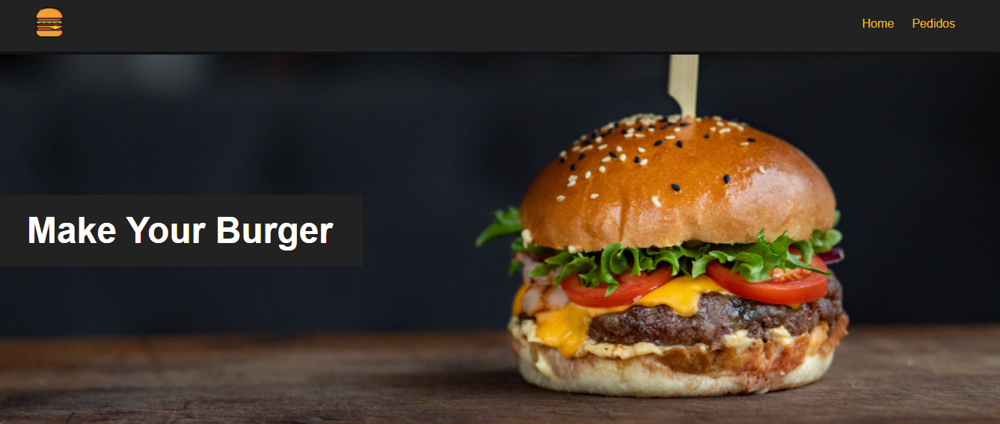

# Make Your Burger

<center>
    </img>
    </img>
    </img>
    </img>
    </img>
</center>



**Escolha o pão, a carne, outros ingredientes e monte seu hamburguer!**

## Configuração Inicial do Projeto
```
npm install
```

### Comando para compilar e atualizar página em  desenvolvimento
```
npm run serve
```

### Comando para compilar e minificar código para produção
```
npm run build
```

### Para configurações personalizadas
Veja [Configuration Reference](https://cli.vuejs.org/config/).
